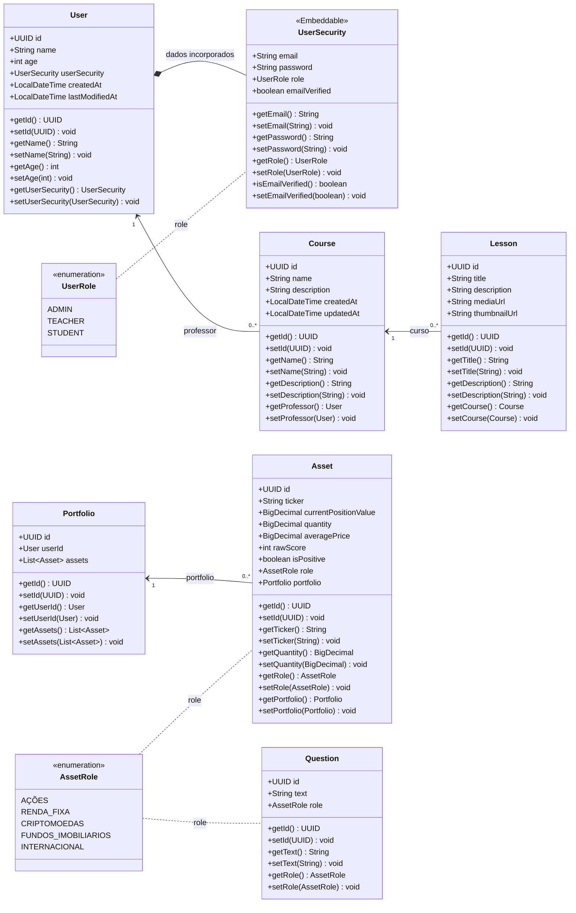
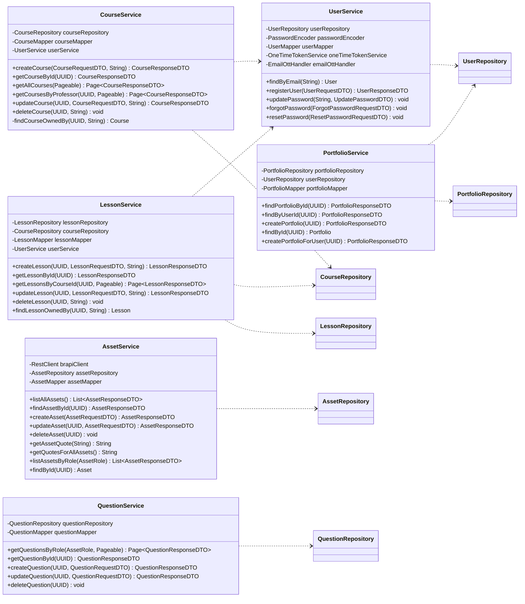

# Diagrama de classes

Diagrama das entidades e serviços centrais identificados em `src/main/java`, com atributos e operações.

## Serviços e operações

## Observações

- `UserSecurity` é `@Embeddable` e faz parte de `User`, não sendo uma entidade independente.
- As relações `Course`–`User` (professor), `Lesson`–`Course`, `Portfolio`–`User` e `Portfolio`–`Asset` têm anotações JPA no código. `AssetRole` classifica ativos e perguntas como enum.
- O enum `UserRole` está representado com os valores definidos atualmente: `ADMIN`, `TEACHER` e `STUDENT`.
- Os getters e setters mostrados nos modelos são gerados por Lombok (`@Data`). Lombok também gera `equals`, `hashCode`, `toString` e, conforme as anotações, construtores sem argumentos e completos.
- O segundo diagrama lista os atributos de dependência e métodos públicos/de apoio declarados nos serviços. Os métodos HTTP dos controllers e os métodos derivados dos repositórios não foram repetidos aqui.
